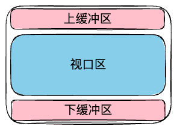

## note

### 虚拟列表

#### 固定高度的

比如说：一共有 1000 条数据（每条数据高度 50px），但是展示出来的只有 8 条数据（高度也就是 400px）；然后留了上下 5 条的缓冲区；

外层盒子也就是 400px；而存放数据的盒子应该是 50 * 1000；

```vue
<template>
  <div id="outer" class="overflow-auto" style="height: 400px">
    <div id="inner" :style="`height: ${data.length * 50}px`">{{...}}</div>
    </div>
</template>
```



我们第一次渲染，至少要渲染出 8(展示 8 条) + 5(上面的缓冲 5 条) + 5(下面的缓冲 5 条) = 18 条数据；

然后在 outer 开始滚动的时候，需要去监听 outer 的滚动事件，获取它的滚动高度： `e.target.scrollTop`

我们使用 `Math.floor(scrollTop / 数据的高度)` 可以获取当前在视口顶部的数据的 topIndex；比如滚动 240 时：`Math.floor(240 / 50) = 4` 那么说明已经滚动出去的有 4([0, 1, 2, 3] 因为索引从 0 开始) 条数据了；目前顶部的展示的是第 5 条数据；

然后就要去计算上缓冲区了，把当前顶部展示的 index - 5 自然就是缓冲区顶部的 index; 这个 index 也就是 start，截取数据的 start index；但是这里有一个问题：当滚动的高度不够时， startIndex 为负数，所以我们需要处理一下： `const top = Math.floor(scrollTop / baseHeight); const start = top >= buffer ? top - buffer : 0`; 

获取到 topIndex 后，就可以计算当前视口底部数据的 index 那么就是 topIndex + 7 了；为什么是 + 7 呢，因为展示的 8 条数据中已经包括了 topIndex 了，所以 + 7 就是 bottomIndex；

然后就是计算底部的缓冲区了，也很简单就是 bottomIndex + 5 即可；这就获取到了 endIndex;

于是当滚动的时候，我们就可以动态的改变 startIndex, endIndex, 然后动态的截取数据了： `const list = data.slice(startIndex, endIndex)`;

---

截取数据完成，但是数据都是从上往下渲染的，一共只有 18 条数据，那么滚动的时候，会发现数据一下就被滚到上面去了；那么我们就需要把 **「数据固定到视口中」**

要固定的话，核心方法就是一个：**把内容区域一起进行平移**，平移我看 ahooks 用的是 margin-top 但是 transform 会不会更好？比较是用的 gpu，但是无论哪个，因为涉及到 dom 元素的修改，所以一定会引起 dom 树变化，导致回流重绘；

那么平移多少呢？依然应该以 startIndex 作为基准；已经滚动了 500px 那么 topIndex = 10, startIndex = 5 如果以 topIndex 为基准平移，那么就是 500px 很明显并没有为缓冲区留位置；而 startIndex * 50 = 250 刚好是缓冲区的位置；

比较简单的方法，就是再使用一个盒子包裹渲染的数据；然后直接平移这个盒子就行，如下的 list div

```vue
<template>
  <div id="outer" class="overflow-auto" style="height: 400px">
    <div id="inner" :style="`height: ${data.length * 50}px`">
      <div id="list" :style="`transform: translate(0, ${startIndex * baseHeight}px)`">{{...}}</div>
    </div>
  </div>
</template>
```

假如说不允许使用盒子包裹渲染的数据，那么就只能平移 inner 盒子了；但是平移 inner 盒子其实会导致实际的滚动距离变大；比如说现在有 20 条数据也就是 1000 的高度，然后现在视口高度为 400 所以可以滚动的高度应该是 600px;

但是如果我们为 inner 添加了 translateY(300px) 那么现在可以滚动的高度也就是 900px 了；

所以「可以滚动的高度」就变成了 `(inner 高度 - 视口高度) + 平移高度`；然后如同上面的代码那样，translate 是逐渐增大的，就会导致可以滚动的高度也变大；那么就可能导致 **「出现无限滚动的情况，即使数据已经滚动完了但是依然可以向下」**

所以这个时候，我们就需要控制可以滚动的高度，inner 高度无法修改，就需要修改「视口的高度」，代码如下：

```vue
<template>
  <div id="outer" class="overflow-auto" style="height: 400px">
    <div id="inner" :style="`height: ${(data.length - startIndex) * 50}px; transform: translate(0, ${startIndex * baseHeight}px)`">
      {{...}}
    </div>
  </div>
</template>
```

#### 不固定高度的